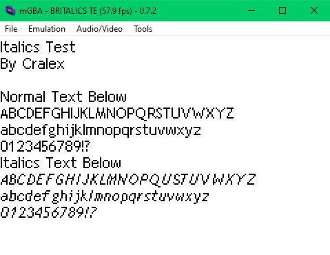
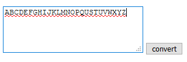
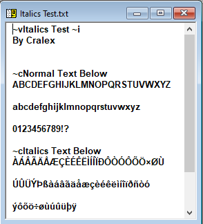
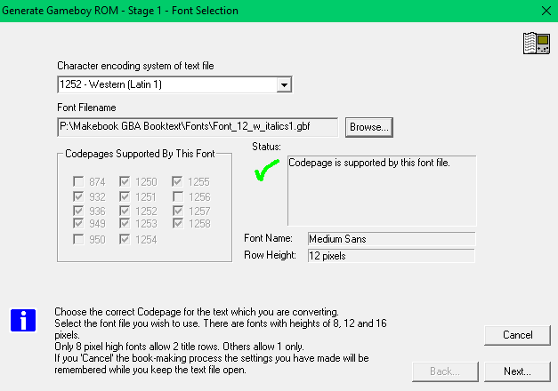

# Gameboy Book Reader Combo Font

A combined standard/italic font for use with Makebook GBA e-book ROM Creator by Pat Crowe.

## What This Is

Makebook is a sophisticated commercial/abondonware utility for Windows that allows a book in TXT format to be converted for consumption on Gameboy (Color) or Gameboy Advance systems, plus emulators that can play software intended for the aforementioned systems. ([More Info](https://archive.org/details/makebook_gba_ebook_creator_v4.92b_20191113),  [Author's Website](http://www.mqp.com/fun/)) The ebook reader used to read these (Gameboy Book Reader) is remarkably full-featured and flexible, but one thing I've always missed about it is support for italic fonts. As a converter that handles TXT files, the results are, by definition, unformatted. However, it does include a built-in font editor, allowing anyone to design their own fonts.

## Why Italics?

Italics are a handy way to add flavor to text in a book. They can be used to emphasize words, express a character's thoughts, or convey unspoken means of communication. Depending on the book, the meaning doesn't always come across properly without them. This leaves anyone eccentric enough to want a book in Gameboy format with three options:

1. Ignore the italics.
2. Use another way to express italics, such as < and >.
3. Make a font that contains both standard and italic characters.

For anyone stubborn enough to want the third option, including myself, I made one possible font that does this.

## How To Use It

The font works by replacing characters that aren't commonly used in my ebook library with italic characters. They will look strange in the Makebook Editor, but will be properly drawn in the resulting ROM. To make it easy to convert text to use this font, I made a small javascript utility to convert any text you type into it into the designated italic characters. Download it [here](https://github.com/Cralex/Gameboy-Book-Reader-Combo-Font/raw/main/Sample%20Files/Formatting-Tool.zip) and open it in any web browser.

Press the convert button, and paste the results back in Makebook.

 Download ** and select it when exporting your book. 

If everything went well, your book will have snazzy new italics. Happy reading!

## To-Do

1. The font I made is a hybrid of the default *Font_12.gbf* included with the program and the font from *The Legend of Zelda Link's Awakening*, which is always italic. I'm no professional font creator, though, so I'm sure it could look prettier. ~~Maybe someone would like to improve it?~~ I also didn't bother making other font sizes.
2. The characters that I sacrificed to make the font are mostly accented Latin characters. This works fine, unless there is some non-English text is included in your book… It would be possible to make a modified version that doesn't replace these characters, or only replaces those least-likely to be seen, but then you'd need to decide what to swap out instead. (Currency symbols that aren't used, for example.) I may take a crack at this if I have a need to do so for my own personal use. Alternatively, feel free to submit your own!
